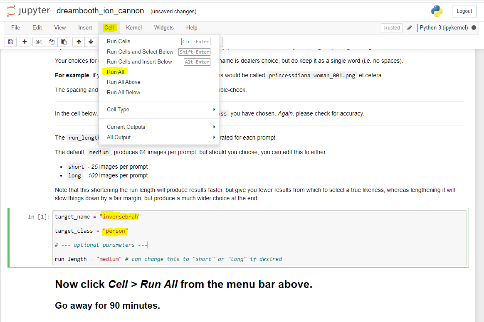

# Dreambooth Ion Cannon

## Purpose

The Dreambooth Ion Cannon is a repository that abstracts away a large chunk of the execution pain points of "The Repo Formerly Known As Dreambooth", providing a layperson an easily accessible guide to uploading photographs, training a Stable Diffusion model on said photographs, and generating images according to pre-selected prompts.

This repo (and particularly this README) should be considered under active development until such time as this line of text disappears, so please pop in every so often in case things still appear piecemeal. I will be adding new prompts on occasion to the model (and have several ideas on how to smooth the path to training multi-subject models), so be aware that this is very much a construction zone.

After finishing the guide (again, active work if you're reading this line), I'll add some points on how to search for prompts and run them yourself using this repository - if you find any that you are particularly impressed with, tag me on Twitter (@functi0nZer0) with a screenshot as well as the prompt text and the seed, and I'll consider them for inclusion!

## Disclaimer

I must reiterate here - the _vast_ majority of this code is not my work.

This repository is a fork of a fork of a fork, with the original by Joe Penna et al being found here, and the work of Kane Wallmann found here.

In the interests of simplicity, I have removed all text in this README that is not directly related to how to use this repository. If you have issues with image quality etc, please read through Kane's repository (as it contains notes from all parties involved). There is a lot of wonderfully insightful stuff in there.

I am focusing my How-To on Vast.AI as the provisioning platform for GPU compute, simply because when I was trying this out, that was the platform that had resources available. Joe recommends using RunPod with his referral link (https://runpod.io/?ref=n8yfwyum) which allows him to continue his work without paying for it - if you're more technically inclined and feel confident that you can run a Jupyter notebook with Pytorch in a platform-agnostic manner, I strongly recommend you do so in order to show support.

## Controlling The Ion Cannon

- 
- 
- 
- 
- 
- 
- 
- 
- 
- 
- 
- 
- 
- 
- 
- 
- 
- 
- 
- 